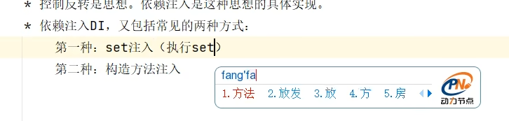
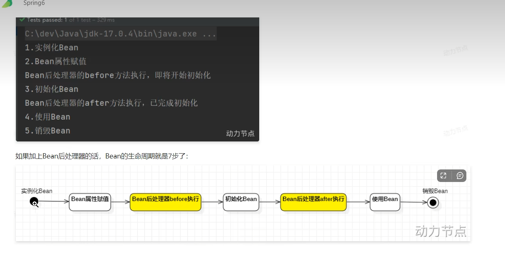
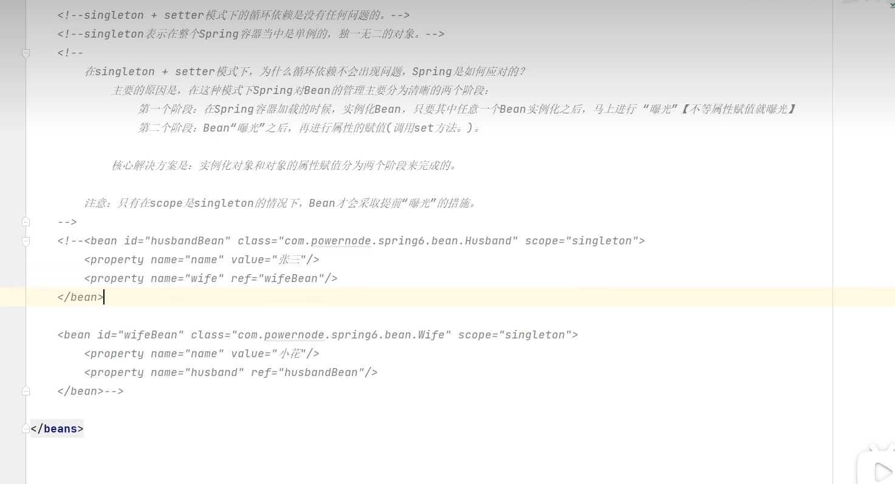

1.OCP？
软件开发原则中基本原则：开闭原则
“不要动以前的代码”不然以前的所有代码都要重新测试
2.依赖倒置原则(DIP)
上依赖下就不符合
面向接口编程
降低程序的耦合度，提高扩展力
3.控制反转编程思想：IOC
XML解析+工厂模式+反射机制就是IOC的底层原理
反转的是两件事：（1）不用程序中采用硬编码方式来new对象（new对象权力交出去了）
（2）不用硬编码方式来维护对象的关系了（对象之间的维护权也交出去了）
4.spring可以实现上面。依赖注入是控制反转（思想）的实现（IOC和AOP支撑）

依赖：A对象和B对象的关系  
注入：是一种手段，通过手段使AB发生关系
DI：依赖注入
p命名注入是为了简化set注入
c命名是为了简化构造注入

5.spring默认情况下是单例的在spring初始化的时候实例化
将bean的scope属性设置为prototype时候每一次调用getBean的时候才会初始化

